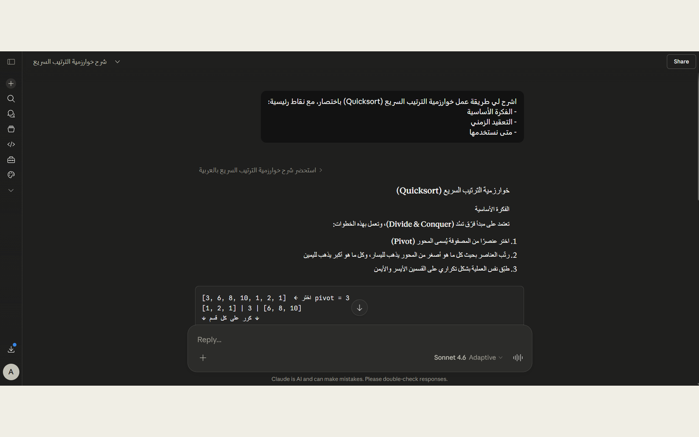
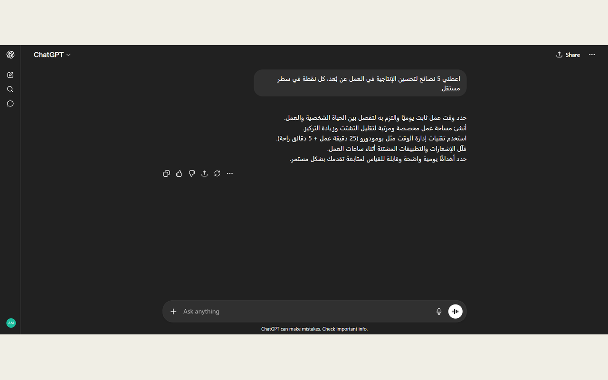
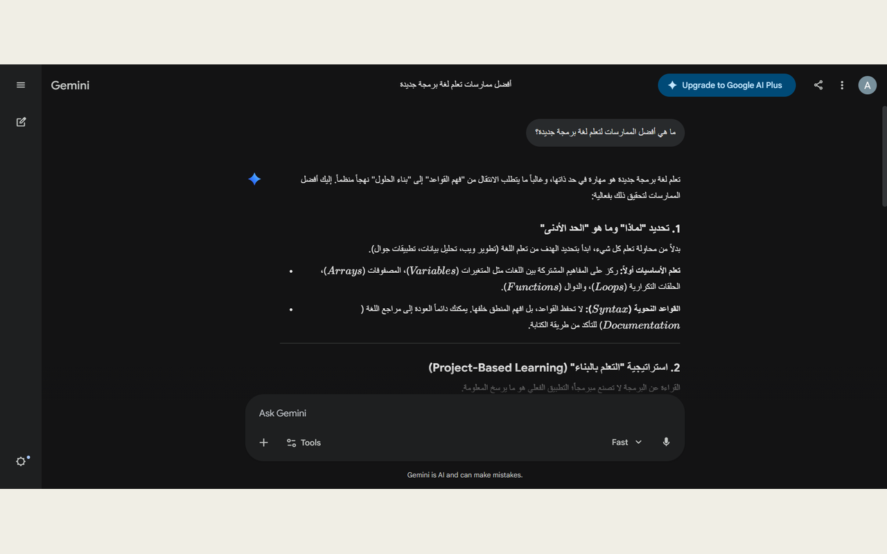
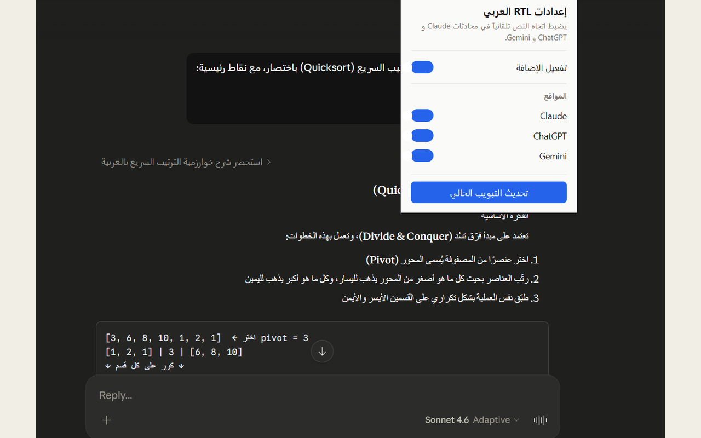

# Arabic RTL for AI Chats

> Auto-aligns Arabic text right-to-left in Claude, ChatGPT, and Gemini —
> paragraph-aware, layout-safe, privacy-first.

> إضافة متصفح تضبط محاذاة النصوص العربية تلقائياً في محادثات
> Claude و ChatGPT و Gemini، فقرةً فقرة، دون كسر تخطيط الموقع.

[](LICENSE)
[](https://developer.chrome.com/docs/extensions/mv3/intro/)
[](#)

---

## The problem

Three of the most-used AI chat platforms — Claude, ChatGPT, and Gemini —
render Arabic text inconsistently. Messages appear left-aligned, punctuation
breaks in the wrong places, and bullets in numbered lists end up stranded on
the far left while the actual text is on the right. For an Arabic-speaking
user, every long answer becomes harder to scan than it should be.

## The solution

This extension applies the standard HTML `dir="auto"` attribute to text-bearing
elements that contain Arabic characters, on every page of the supported sites.
The browser's native bidirectional algorithm then resolves the direction of
each paragraph independently — exactly the way modern text editors like
**Obsidian** handle multilingual documents.

No ML, no heuristics, no gimmicks. Just doing what the platforms should have
done themselves.

---

## Features

- **Universal coverage** — every Arabic paragraph on the page (sidebar items,
  message bubbles, lists, headings, tooltips), not just the input box.
- **Paragraph-level direction** — each paragraph gets its own direction;
  mixed Arabic/English documents render side by side correctly.
- **Smart list bullets** — `<ul>` and `<ol>` containers flip to RTL when their
  items contain Arabic, so bullets sit next to the text instead of being
  stranded on the far side.
- **Code stays LTR** — `pre`, `code`, and `kbd` are forced left-to-right even
  inside Arabic paragraphs. Snippets never break.
- **Layout-safe** — never flips `flex` or `grid` containers; only text-bearing
  elements are affected. The chat UI stays exactly as designed.
- **Per-site toggle** — enable or disable on each platform individually.
- **Privacy-first** — no analytics, no remote code, no servers, no data
  collection. Everything happens locally in the browser.

---

## Supported sites

| Platform | Domain |
|---|---|
| Claude | `claude.ai` |
| ChatGPT | `chatgpt.com`, `chat.openai.com` |
| Gemini | `gemini.google.com` |

---

## Screenshots

| Claude | ChatGPT |
|---|---|
|  |  |

| Gemini | Popup |
|---|---|
|  |  |

---

## Install

### From the Chrome Web Store
*(Coming soon — pending review.)*

### From source (developer mode)

1. Clone or download this repository.
2. Open `chrome://extensions` in your browser.
3. Enable **Developer mode** (top-right toggle).
4. Click **Load unpacked** and select the project root folder.
5. Open Claude / ChatGPT / Gemini and start chatting in Arabic.

---

## How it works

The extension uses three building blocks, all native to the web platform:

1. **`dir="auto"` attribute** — the official HTML mechanism for paragraph-level
   direction detection. The browser inspects the first strong character and
   sets the resolved direction accordingly.
2. **`MutationObserver`** — watches for newly added DOM nodes (chat messages
   appear without page reloads in single-page apps) and applies the same
   treatment to them.
3. **Scoped CSS overrides** — a small stylesheet ensures `code` blocks stay
   LTR, list padding flips to logical `padding-inline-start`, and existing
   site styles don't override the new direction.

A curated allow-list of "text-bearing" tags (`P`, `LI`, `UL`, `OL`,
`H1`–`H6`, `BLOCKQUOTE`, etc.) is processed; layout containers (`flex`,
`grid`) are deliberately skipped to avoid flipping the chat UI itself.

---

## Project structure

```
Arabic RTL/
├── manifest.json              Manifest V3, declares permissions and content scripts
├── src/
│   ├── content.js             Direction-detection logic + MutationObserver
│   └── styles.css             RTL alignment + LTR isolation for code blocks
├── popup/
│   ├── popup.html             Settings UI (per-site toggles)
│   ├── popup.css              Popup styles
│   └── popup.js               chrome.storage.sync bindings
├── icons/                     16 / 32 / 48 / 128 px brand icons
├── screenshots/               Source screenshots and store-ready 1280×800 versions
├── privacy-policy.html        Bilingual privacy policy
└── README.md
```

---

## Permissions

This extension requests only what it needs:

| Permission | Why |
|---|---|
| `storage` | Save the user's enable/disable preferences locally |
| `activeTab` | Reload the current tab from the popup after a settings change |
| Host permissions for the four supported domains | Inject the content script that adjusts direction |

No `<all_urls>`. No `tabs`. No `scripting`. No remote endpoints.

---

## Privacy

Read the full [privacy policy](privacy-policy.html). The short version:

> This extension does not collect, store, transmit, or share any user data.
> All processing happens locally inside your browser. Settings are saved with
> `chrome.storage.sync` and never leave the user's Google account.

---

## Development

The codebase is intentionally tiny — a single content script, a popup, and a
manifest. There is no build step. To make changes:

1. Edit any file under `src/` or `popup/`.
2. Reload the extension from `chrome://extensions`.
3. Refresh the chat tab.

To package a release:

```bash
python -c "
import zipfile, os
files = ['manifest.json', 'src/content.js', 'src/styles.css',
         'popup/popup.html', 'popup/popup.css', 'popup/popup.js',
         'icons/icon16.png', 'icons/icon32.png',
         'icons/icon48.png', 'icons/icon128.png']
with zipfile.ZipFile('arabic-rtl.zip', 'w', zipfile.ZIP_DEFLATED) as z:
    for f in files: z.write(f, arcname=f)
"
```

---

## Contributing

Issues and pull requests are welcome. If you find a site selector that no
longer works (the AI chat platforms change their HTML often), open an issue
with the affected URL and a minimal repro.

---

## License

MIT — see [LICENSE](LICENSE).

---

## Disclaimer

This is an independent, community-built extension. It is **not affiliated
with, endorsed by, or sponsored by Anthropic (Claude), OpenAI (ChatGPT), or
Google (Gemini)**. All product names, logos, and trademarks belong to their
respective owners.

---

<div dir="rtl">


### المشكلة
عند الكتابة بالعربية في Claude أو ChatGPT أو Gemini، النصوص تظهر مُحاذاة لليسار،
وعلامات الترقيم تنكسر، والنقاط في القوائم تطفر بعيداً عن النصوص. هذا يجعل قراءة
الردود الطويلة أبطأ بكثير مما ينبغي.

### الحل
تستخدم الإضافة خاصية HTML المعيارية `dir="auto"` على كل عنصر يحتوي حروفاً
عربية، فيتولّى المتصفح ضبط اتجاه كل فقرة على حدة — وهي نفس الآلية التي يعتمدها
محرر Obsidian للنصوص ثنائية الاتجاه.

### المزايا
- **تغطية شاملة** — تعمل على كل عناصر الصفحة لا حقل الإدخال فقط.
- **محاذاة على مستوى الفقرة** — كل فقرة تحدّد اتجاهها باستقلالية.
- **نقاط القوائم** — تنتقل تلقائياً إلى يمين النص العربي.
- **الأكواد تبقى يساراً** — حتى داخل الفقرات العربية.
- **آمنة على التخطيط** — لا تقلب حاويات flex/grid.
- **مفاتيح منفصلة لكل موقع**.
- **لا تجمع أي بيانات** — كل المعالجة محلية.

### التركيب من المصدر
1. حمّل الريبو.
2. افتح `chrome://extensions` وفعّل **Developer mode**.
3. اضغط **Load unpacked** واختر مجلد المشروع.
4. افتح أحد المواقع المدعومة واكتب بالعربية.

### الترخيص
رخصة MIT — يحقّ لأي شخص الاستخدام والتعديل والتوزيع.

### تنبيه
الإضافة مشروع مستقل، **غير تابعة ولا مدعومة من Anthropic أو OpenAI أو Google**.

</div>
